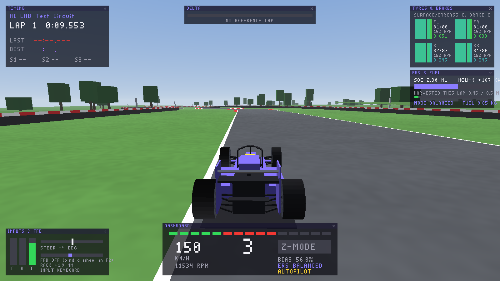

# f1sim – F1 simulátor (AI LAB)

Desktopová hra / simulátor Formuly 1 s dôrazom na **realistickú fyziku,
ovládanie na volante s pedálmi a force feedback**. Grafika je zatiaľ
jednoduchá (placeholder). Modely auta a trate sa dajú kedykoľvek vymeniť
(glTF/GLB), fyzika je samostatná knižnica pripravená aj na neskorší prechod
do Unreal Engine 5.

Aktuálny stav: **Time Trial** na krátkej testovacej trati (2,5 km) a na
ľubovoľnej trati zo stredovej čiary (CSV).



---

## Rýchly štart (Windows)

1. Stiahni zostavenú hru:
   - GitHub → **Actions** → workflow **f1sim** → posledný beh → artefakt
     `f1sim-windows-x64`, **alebo**
   - zostav si ju sám (nižšie).
2. Rozbaľ a spusti `f1sim.exe`. Priečinok `data` musí byť vedľa exe súboru.
3. Pripoj volant a pedále ešte pred spustením (hot-plug funguje, ale
   pohodlnejšie je mať ich pripojené).
4. Stlač **F2** a naviaž ovládanie (postup nižšie).
5. Jazdi. **Esc** otvorí pauzové menu.

Požiadavky: Windows 10/11, grafika s OpenGL 3.3 (každá karta za posledných
~12 rokov), volant s DirectInput force feedbackom (Logitech, Thrustmaster,
Fanatec, Moza, Simucube, …).

### Nastavenie volantu a pedálov (F2)

| Kláves | Čo spraviť |
|---|---|
| **1** | Otoč volantom **úplne doľava** a vráť do stredu (naviaže os riadenia). |
| **2** | Plyn: zošliapni naplno a pusti. |
| **3** | Brzda: zošliapni naplno a pusti. |
| **4** | Spojka (nepovinné). |
| **5 / 6** | Pádla: preraď hore / dole (stlač tlačidlo). |
| **7** | Aktívna aerodynamika (X-mode). |
| **8 / 9** | Reset auta / prepínanie režimu ERS. |
| **, .** | Rotácia volantu – **musí sa zhodovať s nastavením v ovládači volantu** (napr. 900° alebo 360°). Riadenie je 1:1 s volantom F1 (±180°); za dorazom auta zabráni ďalšiemu otáčaniu soft-lock. |
| **M N** | Maximálny moment tvojej základne (G29 ≈ 2,2 Nm, CSL DD 5–8 Nm, DD Pro 8 Nm, DD1 20 Nm). |
| **G H** | Celkový zisk (gain) FFB. |
| **K L** | Mierka momentu auta (1,0 = skutočný moment F1 volantu po posilňovači). |
| **T** | Test FFB – volant by mal byť **ťahaný doľava**. Ak ide doprava, stlač **I** (invert). |
| **D / F** | Tlmenie a filter FFB (pri direct-drive, ak volant na rovinke kmitá, pridaj tlmenie). |
| **B** | Krivka brzdy (gamma) pre load-cell pedále. |

Všetko sa ukladá do `config/settings.ini` vedľa exe súboru.

Bez volantu sa dá jazdiť aj na **gamepade** (ľavá páčka, RT/LT, RB/LB)
alebo **klávesnici** – tam je riadenie zámerne asistované (menší rozsah pri
rýchlosti). Na realistický zážitok je určený volant.

### Ovládanie počas jazdy

| Kláves | Funkcia |
|---|---|
| ↑ / ↓ | plyn / brzda (klávesnica) |
| ← / → | riadenie (klávesnica) |
| A / Z (L-Shift / L-Ctrl) | preradenie hore / dole |
| Medzerník | aktívna aerodynamika (X-mode na rovinke, pri brzdení sa sama zatvorí) |
| E | režim ERS: vyvážený / kvalifikačný / nabíjanie |
| [ / ] | rozdelenie bŕzd dozadu / dopredu |
| C / V | ďalšia / predchádzajúca kamera |
| − / = | zorné pole (FOV) |
| F3 alebo myš k pravému okraju | panel aplikácií |
| R | reštart z boxovej rovinky |
| Backspace | vrátiť auto na trať |
| F5 | autopilot (robot jazdí sám – ukážka) |
| F1 | pomoc |
| Esc / P | pauzové menu |

**Kamery:** kokpit, prilba (hlava sa hýbe podľa G-síl), T-cam (nad airboxom),
nos, bočná (pri prednom kolese), dozadu, zadná blízka, zadná vzdialená, TV
kamery pri trati.

**Aplikácie (HUD, v štýle Assetto Corsa):** časomiera so sektormi, prístrojová
doska (radiace svetlá, rýchlosť, rýchlostný stupeň), pneumatiky a brzdy
(povrch/kostra/tlak), ERS a palivo, vstupy a FFB (vrátane klipovania), delta,
G-meter, živý graf telemetrie (10 s), mapa trate, podvozok a aerodynamika
(svetlá výška, prítlak, zaťaženie kolies, šmyky), info o relácii. Zapínajú
sa v paneli na pravom okraji, presúvajú ťahaním za lištu, rozloženie sa
ukladá.

**Pravidlá:** mimo trate sú všetky 4 kolesá za bielou čiarou → kolo je
neplatné (ako v F1). Každé dokončené kolo sa uloží ako CSV telemetria do
priečinka `telemetry/`.

---

## Zostavenie zo zdrojákov

Potrebuješ CMake ≥ 3.20 a C++17 kompilátor. SDL3 sa stiahne automaticky.

**Windows (Visual Studio 2022):**

```bat
cd sim
cmake -S . -B build -G "Visual Studio 17 2022" -A x64
cmake --build build --config Release
build\Release\f1sim.exe
```

**Linux:**

```bash
cd sim
cmake -S . -B build -G Ninja -DCMAKE_BUILD_TYPE=Release
cmake --build build
./build/f1sim
```

(Na Linuxe treba vývojové balíčky OpenGL/X11, napr. `libgl-dev libegl-dev libx11-dev libxext-dev`.)

**Windows build z Linuxu (MinGW):**
`cmake -S . -B build-win -DCMAKE_TOOLCHAIN_FILE=cmake/mingw-w64.cmake && cmake --build build-win`

Voľby: `-DF1SIM_BUILD_APP=OFF` zostaví iba fyziku, testy a benchmark.

### Testy a validácia

```bash
./build/f1sim_tests        # 23 regresných testov (pneumatika, trať, vozidlo, ERS, FFB, časomiera…)
./build/f1sim_bench        # validačná správa proti verejným hodnotám F1
./build/f1sim_bench data/cars/f1_2026_generic.ini data/tracks/Monza.csv --telemetry monza.csv
```

Ukážka výstupu benchmarku je v [docs/PHYSICS.md](docs/PHYSICS.md#validácia).

---

## Vlastné modely auta (glTF / GLB)

Hra načíta ľubovoľný glTF 2.0 model: z Blenderu, zo Sketchfabu alebo
z generátora 3D modelov (Meshy, Tripo, Rodin, …).

1. Ulož súbory do `data/models/`, napr. `my_car.glb` a `my_wheel.glb`.
2. V `data/models/car_model.ini` nastav `body.file = models/my_car.glb`
   a `wheel.file = models/my_wheel.glb`.
3. Hra model automaticky zmenší/zväčší na rozmery auta (dĺžka 5,3 m,
   priemer kolesa 720 mm) a posadí ho na zem. Jemné doladenie:
   `yaw_deg`, `offset_x/y/z`, `scale`.

Najlepší výsledok: karoséria **bez kolies** + jedno samostatné koleso
(kolesá sa potom točia, zatáčajú a pracujú s pružením). Ak máš model
s kolesami „napevno“, nastav `body.includes_wheels = true`.

## Vlastné trate

- `.trk` – vlastný formát (rovinky/oblúky, automatické uzavretie),
  pozri `data/tracks/test_circuit.trk`.
- `.csv` – formát TUM racetrack-database `x_m,y_m,w_tr_right_m,w_tr_left_m[,z_m]`.
  - `python scripts/fetch_tum_track.py Monza` stiahne stredovú čiaru a šírky.
  - `python scripts/track_from_fastf1.py --year 2025 --event Austria --out data/tracks/rbr.csv`
    vytvorí trať s **reálnym prevýšením** z telemetrie F1.
- Trať sa vyberá v `config/settings.ini` → `content.track = tracks/Monza.csv`.

## Porovnanie s reálnou F1

```bash
pip install fastf1 numpy matplotlib
python scripts/fastf1_export.py --year 2025 --event Monza --session Q --out real.csv
python scripts/compare_laps.py telemetry/lap_XXXX.csv real.csv --labels SIM F1 --out compare.png
```

Graf porovná rýchlosť, plyn, brzdu, prevodový stupeň a priebežnú stratu času.

---

## Štruktúra

```
sim/
  core/          fyzikálne jadro (C++17, bez závislostí) – pneumatiky, auto, trať, ERS, FFB, časomiera, AI
  app/           hra: SDL3 okno + OpenGL, volant/pedále/FFB, kamery, HUD aplikácie, glTF modely
  data/cars/     parametre auta (každá hodnota so zdrojom a mierou istoty)
  data/tracks/   trate
  data/models/   3D modely a ich nastavenie
  tests/         regresné testy
  tools/         benchmark (validačná správa)
  scripts/       Python: FastF1 export, trate z FastF1/TUM, porovnanie kôl
  docs/          fyzika, dáta, plán
```

Dokumentácia: [fyzikálny model](docs/PHYSICS.md) · [dáta a zdroje](docs/DATA.md) · [plán a nástroje](docs/ROADMAP.md)

## Licencie tretích strán

SDL3 (zlib), stb_image / stb_image_write / stb_easy_font (public domain),
cgltf (MIT). Trate z TUM racetrack-database sú pod LGPL-3.0 a v repozitári
nie sú – sťahujú sa skriptom.
