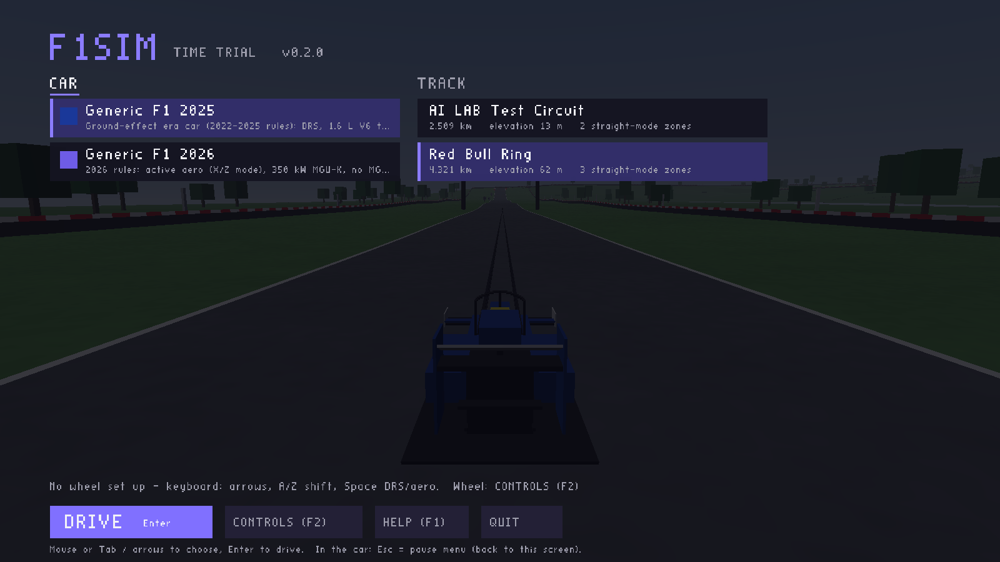
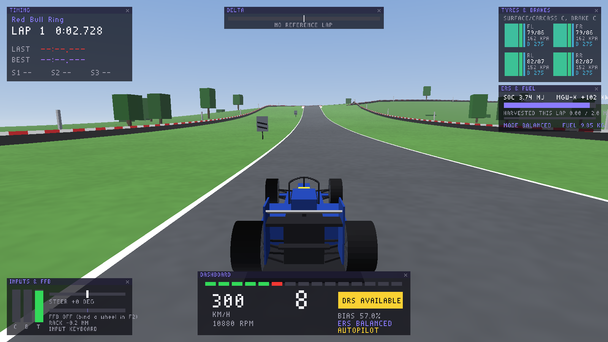

# f1sim – F1 simulátor (AI LAB)

Desktopová hra / simulátor Formuly 1 s dôrazom na **realistickú fyziku,
ovládanie na volante s pedálmi a force feedback**. Grafika je zatiaľ
jednoduchá (placeholder). Modely auta a trate sa dajú kedykoľvek vymeniť
(glTF/GLB), fyzika je samostatná knižnica pripravená aj na neskorší prechod
do Unreal Engine 5.

Aktuálny stav (v0.2): **Time Trial**, hlavné menu s výberom auta a trate.

- Autá: **F1 2025** (ground-effect éra, DRS, MGU-H) a **F1 2026** (aktívna
  aerodynamika X/Z, 350 kW MGU-K). Parametre sú odhady z verejných údajov,
  každá hodnota má v súbore zdroj a mieru istoty.
- Trate: **Red Bull Ring** (stredová čiara z TUM racetrack-database,
  prevýšenie 62 m z Copernicus DEM, 3 DRS zóny) a krátka testovacia trať.
- Volanty: automatické predvoľby FFB pre Logitech G29/G920/G923/G PRO,
  Thrustmaster, Fanatec, Moza, Simucube, Asetek, Simagic.





---

## Rýchly štart (Windows)

1. Stiahni najnovšiu zostavu (vytvára sa automaticky po každej zmene):
   **https://github.com/Bendzo19/AI-LAB-WEB/releases/download/f1sim-latest/f1sim-windows-x64.zip**
   (alebo si ju zostav sám – nižšie).
2. Rozbaľ celý priečinok a spusti `f1sim.exe`. Priečinok `data` musí byť
   vedľa exe súboru. Windows SmartScreen môže upozorniť na nepodpísanú
   aplikáciu → „Ďalšie informácie“ → „Spustiť aj tak“.
3. Pripoj volant a pedále ešte pred spustením (hot-plug funguje, ale
   pohodlnejšie je mať ich pripojené).
4. V hlavnom menu vyber auto a trať, klikni **CONTROLS (F2)** a stlač
   **Enter** – sprievodca naviaže volant, pedále a pádla (postup nižšie).
5. **DRIVE**. Počas jazdy **Esc** otvorí pauzové menu (odtiaľ sa dá vrátiť
   do hlavného menu a zmeniť auto/trať).

Požiadavky: Windows 10/11, grafika s OpenGL 3.3 (každá karta za posledných
~12 rokov), volant s DirectInput force feedbackom (Logitech, Thrustmaster,
Fanatec, Moza, Simucube, …).

### Nastavenie volantu a pedálov (F2)

**Enter** spustí sprievodcu: postupne sa pýta na riadenie, plyn, brzdu,
spojku, pádla a aktívnu aerodynamiku (DRS). **Medzerník** preskočí krok
(napr. spojku), **Esc** sprievodcu zastaví. Po naviazaní riadenia sa podľa
názvu zariadenia **automaticky použije predvoľba volantu** (moment
základne, rotácia 900°, filter, kompenzácia mŕtvej zóny). Predvoľbu je možné
kedykoľvek použiť znova klávesom **W**.

**Logitech G29 (a G920/G923) – nastavenie v G HUB:**
rotácia **900°**, **Centering Spring vypnutý**, citlivosť 50, TRUEFORCE
vypnutý (G923). V hre je predvoľba: 2,2 Nm, mierka momentu 0,12, filter
60 Hz, minimálna sila 7 % (G29 má ozubené prevody a malé sily by inak
„zapadli“ do mŕtvej zóny). Ak je FFB v rýchlych zákrutách stále „na doraz“
(stĺpec klipovania v aplikácii INPUTS & FFB), zníž **K** (mierka momentu).

Iné volanty: po naviazaní riadenia sa zobrazí, čo nastaviť v ich ovládači
(Fanatec, Thrustmaster, Moza Pit House, Simucube True Drive…).

| Kláves | Čo spraviť |
|---|---|
| **Enter** | Sprievodca (všetko po poradí). |
| **W** | Použiť predvoľbu pre pripojený volant. |
| **1** | Otoč volantom **úplne doľava** a vráť do stredu (naviaže os riadenia). |
| **2** | Plyn: zošliapni naplno a pusti. |
| **3** | Brzda: zošliapni naplno a pusti. |
| **4** | Spojka (nepovinné). |
| **5 / 6** | Pádla: preraď hore / dole (stlač tlačidlo). |
| **7** | DRS (2025) / aktívna aerodynamika X-mode (2026). |
| **8 / 9** | Reset auta / prepínanie režimu ERS. |
| **, .** | Rotácia volantu – **musí sa zhodovať s nastavením v ovládači volantu** (napr. 900° alebo 360°). Riadenie je 1:1 s volantom F1 (±180°); za dorazom auta zabráni ďalšiemu otáčaniu soft-lock. |
| **M N** | Maximálny moment tvojej základne (G29 ≈ 2,2 Nm, CSL DD 5–8 Nm, DD Pro 8 Nm, DD1 20 Nm). |
| **G H** | Celkový zisk (gain) FFB. |
| **K L** | Mierka momentu auta (1,0 = skutočný moment F1 volantu po posilňovači). |
| **T** | Test FFB – volant by mal byť **ťahaný doľava**. Ak ide doprava, stlač **I** (invert). |
| **D / F** | Tlmenie a filter FFB (pri direct-drive, ak volant na rovinke kmitá, pridaj tlmenie). |
| **B** | Krivka brzdy (gamma) pre load-cell pedále. |

Všetko sa ukladá do `config/settings.ini` vedľa exe súboru.

Bez volantu sa dá jazdiť aj na **gamepade** (ľavá páčka, RT/LT, RB/LB)
alebo **klávesnici** – tam je riadenie zámerne asistované (menší rozsah pri
rýchlosti). Na realistický zážitok je určený volant.

### Ovládanie počas jazdy

| Kláves | Funkcia |
|---|---|
| ↑ / ↓ | plyn / brzda (klávesnica) |
| ← / → | riadenie (klávesnica) |
| A / Z (L-Shift / L-Ctrl) | preradenie hore / dole |
| Medzerník | DRS (2025 – len v DRS zóne, HUD ukáže „DRS AVAILABLE“) / aktívna aerodynamika (2026 – X-mode na rovinke); pri brzdení sa zatvorí |
| E | režim ERS: vyvážený / kvalifikačný / nabíjanie |
| [ / ] | rozdelenie bŕzd dozadu / dopredu |
| C / V | ďalšia / predchádzajúca kamera |
| − / = | zorné pole (FOV) |
| F3 alebo myš k pravému okraju | panel aplikácií |
| R | reštart z boxovej rovinky |
| Esc → MAIN MENU | výber auta a trate |
| Backspace | vrátiť auto na trať |
| F5 | autopilot (robot jazdí sám – ukážka) |
| F1 | pomoc |
| Esc / P | pauzové menu |

**Kamery:** kokpit, prilba (hlava sa hýbe podľa G-síl), T-cam (nad airboxom),
nos, bočná (pri prednom kolese), dozadu, zadná blízka, zadná vzdialená, TV
kamery pri trati.

**Aplikácie (HUD, v štýle Assetto Corsa):** časomiera so sektormi, prístrojová
doska (radiace svetlá, rýchlosť, rýchlostný stupeň), pneumatiky a brzdy
(povrch/kostra/tlak), ERS a palivo, vstupy a FFB (vrátane klipovania), delta,
G-meter, živý graf telemetrie (10 s), mapa trate, podvozok a aerodynamika
(svetlá výška, prítlak, zaťaženie kolies, šmyky), info o relácii. Zapínajú
sa v paneli na pravom okraji, presúvajú ťahaním za lištu, rozloženie sa
ukladá.

**Pravidlá:** mimo trate sú všetky 4 kolesá za bielou čiarou → kolo je
neplatné (ako v F1). Každé dokončené kolo sa uloží ako CSV telemetria do
priečinka `telemetry/`.

---

## Pokračovanie na vlastnom PC

`build.bat` (zostaví a otestuje), `run.bat` (spustí), návod na lokálny
vývoj aj s Claude Code, Blenderom a Unrealom: [docs/LOKALNE_SK.md](docs/LOKALNE_SK.md).
Kontext projektu pre Claude Code je v `CLAUDE.md`.

## Zostavenie zo zdrojákov

Potrebuješ CMake ≥ 3.20 a C++17 kompilátor. SDL3 sa stiahne automaticky.

**Windows – Visual Studio 2022 alebo novšie** (pri inštalácii zaškrtni
„Desktop development with C++“, obsahuje aj CMake):

- *Najjednoduchšie:* **File → Open → Folder…** a vyber priečinok `sim`.
  Visual Studio samo načíta `CMakeLists.txt` (prvýkrát stiahne SDL3, chvíľu
  to trvá). Hore zvoľ konfiguráciu **x64-Release**, ako spúšťací cieľ
  **f1sim.exe** a stlač **F5**.
- *Z príkazového riadku* („Developer PowerShell for VS“):

```bat
cd sim
cmake -S . -B build -A x64
cmake --build build --config Release
build\Release\f1sim.exe
```

**Linux:**

```bash
cd sim
cmake -S . -B build -G Ninja -DCMAKE_BUILD_TYPE=Release
cmake --build build
./build/f1sim
```

(Na Linuxe treba vývojové balíčky OpenGL/X11, napr. `libgl-dev libegl-dev libx11-dev libxext-dev`.)

**Windows build z Linuxu (MinGW):**
`cmake -S . -B build-win -DCMAKE_TOOLCHAIN_FILE=cmake/mingw-w64.cmake && cmake --build build-win`

Voľby: `-DF1SIM_BUILD_APP=OFF` zostaví iba fyziku, testy a benchmark.

### Testy a validácia

```bash
./build/f1sim_tests        # 28 regresných testov (pneumatika, trať, vozidlo, ERS, FFB, predvoľby volantov…)
./build/f1sim_bench        # validačná správa proti verejným hodnotám F1
./build/f1sim_bench data/cars/f1_2025_generic.ini data/tracks/red_bull_ring.csv --telemetry rbr.csv
```

Ukážka výstupu benchmarku je v [docs/PHYSICS.md](docs/PHYSICS.md#validácia).

---

## Modely auta (glTF / GLB)

Autá 2025 a 2026 majú 3D model vytvorený v Blenderi skriptom
`scripts/blender/build_car.py` (parametrický: rázvor, rozchod, šírka,
pneumatiky – presne podľa fyziky, takže sedí kokpit aj kamery). Vzniknú
súbory `data/models/f1_20xx_body.glb`, `…_wheel_front.glb`,
`…_wheel_rear.glb`, `steering_wheel.glb` (volant s displejom, tlačidlami
a LED, otáča sa s tvojím volantom) a upraviteľná scéna
`art/blender/f1_20xx.blend`. Tvar vychádza z moderných ground-effect áut
(downwash sidepody, podrezanie, venturi podlaha s doskou, lyžicové zadné
krídlo s DRS, beam wing, difúzor); reálne logá tímov a sponzorov model
zámerne neobsahuje.

Renderer: tiene od slnka (2 kaskády), fyzikálne materiály (kov/drsnosť,
odrazy oblohy), obloha s mrakmi, tone mapping, svietiace LED/dažďové svetlo,
terén z rovnakých výškových dát ako fyzika.

- V Blenderi: otvor `art/blender/f1_2025.blend`, uprav a exportuj
  (File → Export → glTF 2.0, formát GLB, „+Y Up“) karosériu bez kolies do
  `data/models/f1_2025_body.glb`.
- Alebo zmeň rozmery/tvary v skripte a spusti ho znova:
  `blender -b -P scripts/blender/build_car.py -- --car 2025 --out data/models --blend-dir art/blender`
  (alebo v Blenderi: záložka Scripting → otvoriť skript → Run Script).
- Materiály s názvom `Livery…` sa v hre prefarbia farbou z
  `data/cars/*.ini` (`[visual] livery_rgb`), takže jeden model zvládne
  ľubovoľné farby tímu.

Hra načíta aj ľubovoľný iný glTF 2.0 model: z Blenderu, zo Sketchfabu alebo
z generátora 3D modelov (Meshy, Tripo, Rodin, …).

1. Ulož súbory do `data/models/`, napr. `my_car.glb` a `my_wheel.glb`.
2. V konfigurácii modelu auta (napr. `data/models/f1_2025.ini`, odkazuje
   na ňu `[visual] model_config` v súbore auta) nastav
   `body.file = models/my_car.glb` a `wheel.file = models/my_wheel.glb`
   (voliteľne `[wheel_rear]` pre širšie zadné koleso).
3. Hra model automaticky zmenší/zväčší na rozmery auta (dĺžka 5,3 m,
   priemer kolesa 720 mm) a posadí ho na zem. Jemné doladenie:
   `yaw_deg`, `offset_x/y/z`, `scale`.

Najlepší výsledok: karoséria **bez kolies** + jedno samostatné koleso
(kolesá sa potom točia, zatáčajú a pracujú s pružením). Ak máš model
s kolesami „napevno“, nastav `body.includes_wheels = true`.

## Vlastné trate

- `.trk` – vlastný formát (rovinky/oblúky, automatické uzavretie),
  pozri `data/tracks/test_circuit.trk`.
- `.csv` – formát TUM racetrack-database `x_m,y_m,w_tr_right_m,w_tr_left_m[,z_m]`,
  voliteľne s riadkami `# name Red Bull Ring` a `# aero_zone <začiatok_m> <koniec_m>`
  (DRS zóny; bez nich sa zóny odvodia z dlhých rovinek).
  - `python scripts/fetch_tum_track.py Monza` stiahne stredovú čiaru a šírky.
  - `python scripts/build_track_geo.py …` zarovná TUM čiaru na GPS geometriu
    a doplní prevýšenie z Copernicus DEM (takto vznikol Red Bull Ring).
  - `python scripts/track_from_fastf1.py --year 2025 --event Austria --out data/tracks/rbr.csv`
    vytvorí trať s prevýšením z telemetrie F1.
- Každý `.trk`/`.csv` v `data/tracks/` sa automaticky objaví v hlavnom menu.
  Rovnako každé auto v `data/cars/*.ini`.

## Porovnanie s reálnou F1

```bash
pip install fastf1 numpy matplotlib
python scripts/fastf1_export.py --year 2025 --event Monza --session Q --out real.csv
python scripts/compare_laps.py telemetry/lap_XXXX.csv real.csv --labels SIM F1 --out compare.png
```

Graf porovná rýchlosť, plyn, brzdu, prevodový stupeň a priebežnú stratu času.

---

## Štruktúra

```
sim/
  core/          fyzikálne jadro (C++17, bez závislostí) – pneumatiky, auto, trať, ERS, FFB, časomiera, AI
  app/           hra: SDL3 okno + OpenGL, volant/pedále/FFB, kamery, HUD aplikácie, glTF modely
  data/cars/     parametre auta (každá hodnota so zdrojom a mierou istoty)
  data/tracks/   trate
  data/models/   3D modely a ich nastavenie
  tests/         regresné testy
  tools/         benchmark (validačná správa)
  scripts/       Python: FastF1 export, trate z FastF1/TUM, porovnanie kôl, Blender generátor auta
  art/blender/   upraviteľné .blend scény modelov
  docs/          fyzika, dáta, plán
```

Dokumentácia: [fyzikálny model](docs/PHYSICS.md) · [dáta a zdroje](docs/DATA.md) · [plán a nástroje](docs/ROADMAP.md)

## Licencie tretích strán

SDL3 (zlib), stb_image / stb_image_write / stb_easy_font (public domain),
cgltf (MIT). Red Bull Ring: stredová čiara a šírky z TUM racetrack-database
(LGPL-3.0), geometria z bacinger/f1-circuits (MIT), prevýšenie z Copernicus
DEM GLO-30 – podrobnosti a texty licencií v `data/tracks/SOURCES.md` a
`data/tracks/licenses/`.
